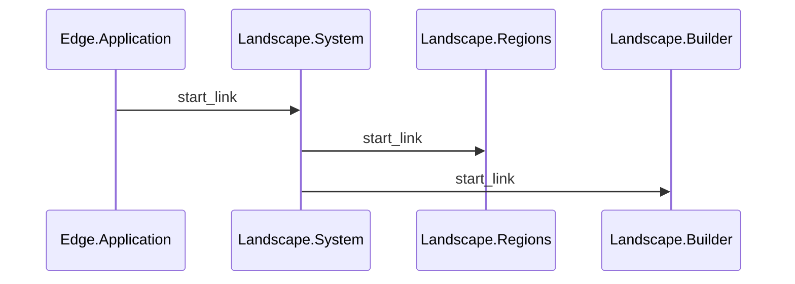

# Landscape System

## Description

**LogatronEdge.Landscape.System** is and LogatronEdge.Application subsystem that is responsible for managing the regions in the landscape.

## Diagrams

### Sequence Diagram

